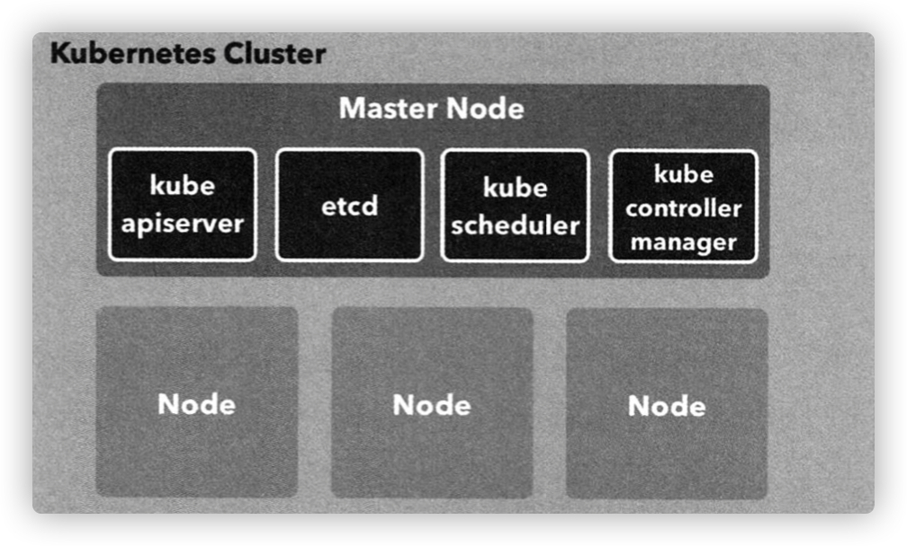
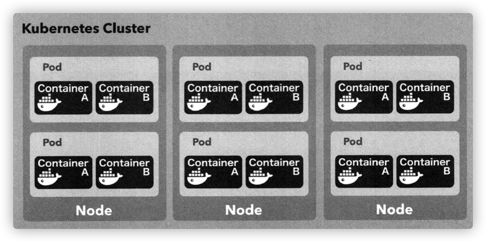
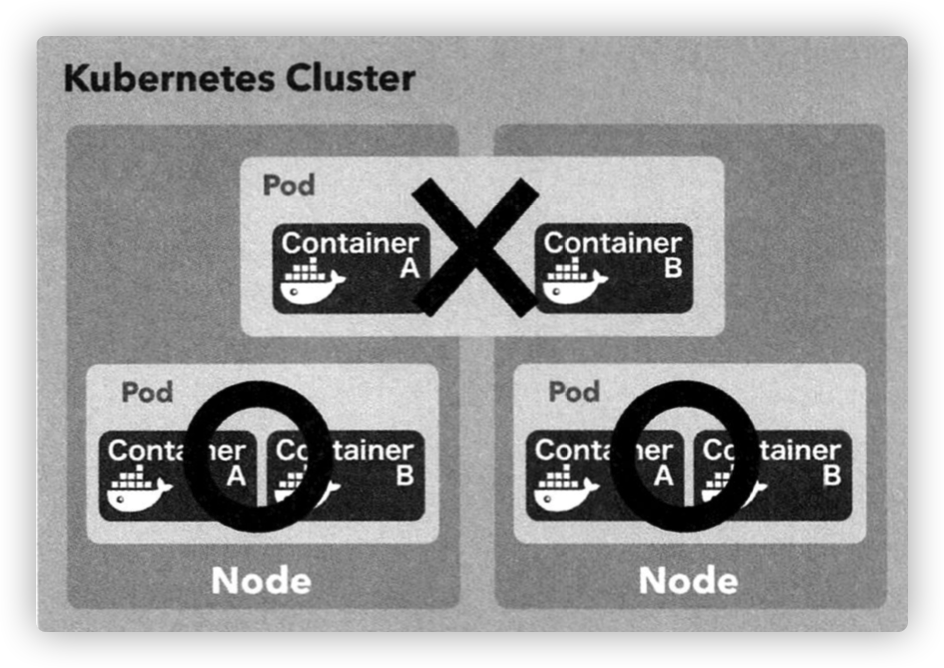
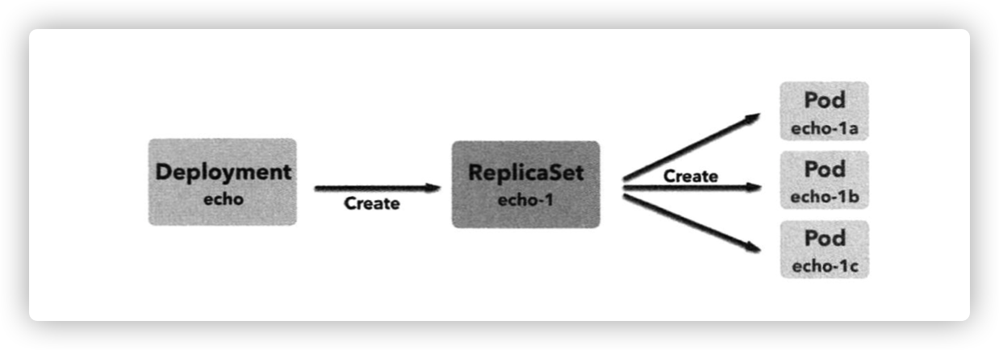
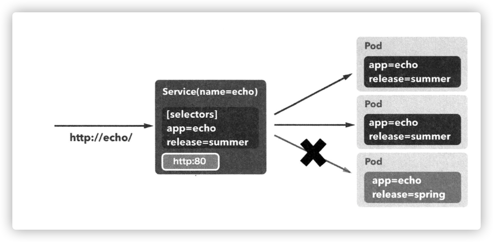

# 쿠버네티스 입문

- [쿠버네티스 입문](#쿠버네티스-입문)
- [1. 쿠버네티스란 무엇인가](#1-쿠버네티스란-무엇인가)
  - [1.1. 도커의 부상과 쿠버네티스의 탄생](#11-도커의-부상과-쿠버네티스의-탄생)
  - [1.2. 쿠버네티스의 역할](#12-쿠버네티스의-역할)
- [2. 로컬 PC 에서 쿠버네티스 실행](#2-로컬-pc-에서-쿠버네티스-실행)
  - [2.1. MacOS 에서 도커 & 쿠버네티스 연동 설정](#21-macos-에서-도커--쿠버네티스-연동-설정)
  - [2.2. kubectl 설치](#22-kubectl-설치)
  - [2.3. 대시보드 설치](#23-대시보드-설치)
- [3. 쿠버네티스의 주요 개념](#3-쿠버네티스의-주요-개념)
- [4. 쿠버네티스 클러스터와 노드](#4-쿠버네티스-클러스터와-노드)
- [5. 네임스페이스](#5-네임스페이스)
- [6. 파드](#6-파드)
  - [6.1. 파드 생성 및 배포하기](#61-파드-생성-및-배포하기)
  - [6.2. 파드 다루기](#62-파드-다루기)
  - [6.3. 파드와 파드 안에 든 컨테이너의 주소](#63-파드와-파드-안에-든-컨테이너의-주소)
- [7. 레플리카세트](#7-레플리카세트)
- [8. 디플로이먼트](#8-디플로이먼트)
  - [8.1. 레플리카세트 생명주기](#81-레플리카세트-생명주기)
  - [8.2. 롤백 실행하기](#82-롤백-실행하기)
- [9. 서비스](#9-서비스)
  - [9.1. release=summer 파드만 접근 가능한 서비스 생성](#91-releasesummer-파드만-접근-가능한-서비스-생성)
  - [9.2. ClusterIP 서비스](#92-clusterip-서비스)
  - [9.3. NodePort 서비스](#93-nodeport-서비스)
  - [9.4. LoadBalancer 서비스](#94-loadbalancer-서비스)
  - [9.5. ExternalName 서비스](#95-externalname-서비스)
- [10. 인그레스](#10-인그레스)

# 1. 쿠버네티스란 무엇인가

- 컨테이너 운영을 자동화하기 위한 컨테이너 오케스트레이션 도구
- 많은 수의 컨테이너를 협조적으로 연동시키기 위한 통합 시스템
- 컨테이너를 다루기 위한 API 및 명령행 도구 (kubectl) 등을 함께 제공
- 도커 호스트 관리, 서버 리소스의 여유를 고려한 컨테이너 배치, 스케일링, 로드 밸런싱, 헬스 체크 등의 기능

<br>

## 1.1. 도커의 부상과 쿠버네티스의 탄생

도커의 문제점
- 배포 및 컨테이너 배치 전략
- 스케일-인 및 스케일-아웃 서비스 디스커버리
- 운영 편의성

문제점을 극복하기 위한 여러 컨테이너 오케스트레이션 도구들의 등장
- 도커 컴포즈 및 스웜
- 아파치 메소스 (Apache Mesos)
- AWS ECS
- **구글 쿠버네티스**

2017년 10월에 도커와 정식 통합

<br>

## 1.2. 쿠버네티스의 역할

- 도커: 컨테이너를 관리하는 데몬인 dockerd 와 명령행 도구로 구성
- 스웜: 여러 대의 호스트를 묶어 기초적인 컨테이너 오케스트레이션 기능 제공
- 쿠버네티스
  - 스웜보다 충실한 기능을 갖춘 컨테이너 오케스트레이션 시스템
  - 도커를 비롯해 여러 가지 컨테이너 런타임을 다룰 수 있음
  - 컴포즈/스택/스웜의 기능을 통합해 더 높은 수준의 관리 기능을 제공


<br>

# 2. 로컬 PC 에서 쿠버네티스 실행

도커에서 제공하는 쿠버네티스 통합 기능을 이용

기존에 설치된 도커 환경에서도 쿠버네티스 환경 구축 가능

<br>

## 2.1. MacOS 에서 도커 & 쿠버네티스 연동 설정

1. MacOS 에서 도커가 설치되어 있다면 `도커 아이콘 > Prefreences > Kubernetes` 진입
2. `Enable Kubernetes` 와 `Show system containers (advanced)` 체크하고 "Apply & Restart" 로 재시작
3. 확인 팝업 나오면 "Install" 클릭


<br>

## 2.2. kubectl 설치

`kubectl` 은 쿠버네티스를 다루기 위한 명령행 도구

로컬 환경이나 운영 환경 모두에서 사용 가능

쿠버네티스 공식 홈페이지에 있는 [설치 가이드](https://kubernetes.io/ko/docs/tasks/tools/install-kubectl-macos/)를 보고 설치 가능

Homebrew 가 가장 간단

<br>

## 2.3. 대시보드 설치

쿠버네티스에 배포된 컨테이너 등에 대한 정보를 한눈에 보여주는 관리 도구

쿠버네티스 공식 홈페이지에 있는 [대시보드 가이드](https://kubernetes.io/ko/docs/tasks/access-application-cluster/web-ui-dashboard/)를 따라하면 됨

```sh
# 대시보드 UI 배포
$ kubectl apply -f https://raw.githubusercontent.com/kubernetes/dashboard/v2.2.0/aio/deploy/recommended.yaml

# STATUS=running 상태로 배포 확인
$ kubectl get pod --namespace=kube-system -l k8s-app=kubernetes-dashboard
NAME                                    READY   STATUS    RESTARTS   AGE
kubernetes-dashboard-556dd8b879-bcpqm   1/1     Running   0          244d

# 대시보드 사용
$ kubectl proxy
Starting to serve on 127.0.0.1:8001
```

- http://localhost:8001/api/v1/namespaces/kubernetes-dashboard/services/https:kubernetes-dashboard:/proxy/ 에 접속해서 대시보드 사용 가능

<br>

# 3. 쿠버네티스의 주요 개념

쿠버네티스의 리소스란 애플리케이션을 구성하는 부품과 같은 것

쿠버네티스 클러스터 안에서 이 리소스들이 연동하고 협조하면서 컨테이너 시스템을 구성

**컨테이너 리소스**

|        리소스        | 용도                                                                        |
| :------------------: | --------------------------------------------------------------------------- |
|         노드         | 컨테이너가 배치되는 서버                                                    |
|     네임스페이스     | 쿠버네티스 클러스터 안의 가상 클러스터                                      |
|         파드         | 컨테이너의 집합 중 가장 작은 단위. 컨테이너의 실행 방법을 정의              |
|     레플리카세트     | 같은 스펙을 갖는 파드를 여러 개 생성하고 관리하는 역할                      |
|     디플로이먼트     | 레플리카 세트의 리비전을 관리                                               |
|        서비스        | 파드의 집합에 접근하기 위한 경로를 정의                                     |
|       인그레스       | 서비스를 쿠버네티스 클러스터 외부로 노출                                    |
|       컨피그맵       | 설정 정보를 정의하고 파드에 전달                                            |
|    퍼시스턴스볼륨    | 파드가 사용할 스토리지의 크기 및 종류를 정의                                |
| 퍼시스턴스볼륨클레임 | 퍼시스턴스 볼륨을 동적으로 확보                                             |
|    스토리지클래스    | 퍼시스턴스 볼륨이 확보하는 스토리지의 종류를 정의                           |
|          잡          | 상주 실행을 목적으로 하지 않는 파드를 여러 개 생성하고 정상적인 종료를 보장 |
|        크론잡        | 크론 문법으로 스케줄링 되는 잡                                              |
|        시크릿        | 인증 정보 같은 기밀 데이터를 정의                                           |
|          롤          | 네임스페이스 안에서 조작 가능한 쿠버네티스 리소스의 규칙을 정의             |
|       롤바인딩       | 쿠버네티스 리소스 사용자와 롤을 연결                                        |
|      클러스터롤      | 클러스터 전체적으로 조작 가능한 쿠버네티스 리소스의 규칙을 정의             |
|   클러스터롤바인딩   | 쿠버네티스 리소스 사용자와 클러스터롤을 연결                                |
|     서비스 계정      | 파드가 쿠버네티스 리소스를 조작할 때 사용하는 계정                          |

<br>

# 4. 쿠버네티스 클러스터와 노드

**쿠버네티스 클러스터**
- 쿠버네티스 클러스터는 쿠버네티스의 여러 리소스를 관리하기 위한 집합체
- 쿠버네티스 리소스 중에서 가장 큰 개념은 노드 (node)
- 마스터와 노드의 그룹으로 구성됨

**노드**
- 쿠버네티스 클러스터의 관리 대상으로 등록된 도커 호스트로, 컨테이너가 배치되는 대상
  - 정확히 말하면 컨테이너의 호스트, 이 책에서는 도커 호스트에 해당
  - 물리 머신, 가상 머신을 구분하지 않고 모두 노드라 함
- 클러스터 전체를 관리하는 서버인 마스터 노드가 필요함
- 클러스터에 배치된 노드의 수, 노드의 사양 등에 따라 배치할 수 있는 컨테이너 수가 결정됨
- 클러스터의 처리 능력은 노드에 의해 결정




<br>

로컬 환경에 설치한 쿠버네티스에는 클러스터를 생성할 때 만든 가상 머신이 노드로 등록되어 있음


```sh
# 현재 클러스터에 소속된 노드의 목록 확인 가능
$ kubectl get nodes
NAME    STATUS   ROLES     AGE    VERSION
```

<br>

# 5. 네임스페이스

- 쿠버네티스는 클러스터 안에 가상 클러스터를 또 다시 만들 수 있음
- **클러스터 안의 가상 클러스터가 네임스페이스 (namespace)**
- 클러스터를 처음 구축하면 4 개의 네임스페이스가 이미 만들어져 있음
  - default
  - docker
  - kube-public
  - kube-system
- 개발팀이 일정 규모 이상일 때 유용
  - 개발자마다 자신만의 네임스페이스를 두면 메인 네임스페이스가 어질러지는 것을 방지
  - 네임스페이스마다 권한 설정 및 제어 가능

```sh
# 현재 클러스터 안에 존재하는 네임스페이스의 목록 확인
$ kubectl get namespace
NAME                   STATUS   AGE
cbt                    Active   244d
default                Active   244d
ingress-nginx          Active   244d
kakao-system           Active   92d
kube-node-lease        Active   244d
kube-public            Active   244d
kube-system            Active   244d
kubernetes-dashboard   Active   70m
monitoring             Active   244d
prod                   Active   169d
```

<br>

# 6. 파드

**컨테이너와의 관계**
- 컨테이너가 모인 집합체의 단위, 적어도 하나 이상의 컨테이너로 이루어짐
- 쿠버네티스와 도커를 함께 사용한다면 파드는 컨테이너 하나 혹은 컨테이너의 집합체가 됨
- Nginx 와 Go 애플리케이션처럼 결합이 강한 컨테이너를 파드로 묶어 일괄 배포
- 컨테이너가 하나인 경우에도 파드로 배포

**노드와의 관계**
- 파드는 노드에 배치해야 함
- 같은 파드를 여러 노드에 배치 가능
- 한 노드에 여러 개 배치 가능
- 한 파드 안의 컨테이너는 모두 같은 노드에 배치해야함 (파드 하나가 여러 노드에 걸쳐 배치될 수 없음)





<br>

**파드의 적절한 크기는 어느정도 인가**
- 파드 전체가 한 노드에 배치되어야 함
- 예를 들어 리버스 프록시 역할의 Nginx 와 애플리케이션 컨테이너를 함께 파드로 묶는 구성이 일반적
- 함께 배포해야 정합성을 유지할 수 있는 컨테이너 등도 같은 파드로 묶어두는 게 좋음
- 마스터 노드
  - 도커 스웜은 매니저노드가 스웜 클러스터 전체를 제어
  - 쿠버네티스에서는 관리용 서버인 마스터 노드가 그 역할을 담당
  - 마스터 노드는 관리용 컴포넌트가 담긴 파드만 배포된 노드
  - 애플리케이션에 사용되는 파드는 배포 불가능

<br>

## 6.1. 파드 생성 및 배포하기

3장에서 사용했던 nginx-proxy 와 echo 애플리케이션, 2개의 컨테이너를 포함하는 파드를 로컬 쿠버네티스 환경에 배포해보자

(만약 nginx-proxy 가 없으면 `docker image pull gihyodocker/nginx-proxy:latest` 로 내려받기)

<br>

**1) 매니페스트 파일 작성**

쿠버네티스의 여러가지 리소스를 정의하는 파일

파드 생성은 `kubectl` 만 사용해도 가능하지만 버전 관리 관점에서도 `yaml` 파일로 정의하는 것이 좋음

nginx 와 echo 두 컨테이너로 구성되는 파드를 정의한 메니페스트 파일을 `simple-pod.yaml` 이라는 이름으로 작성

```yaml
apiVersion: v1
kind: Pod
metadata:
  name: simple-echo
spec:
  containers:
  - name: nginx
    image: gihyodocker/nginx:latest
    env:
    - name: BACKEND_HOST
      value: localhost:8080
    ports:
    - containerPort: 80
  - name: echo
    image: gihyodocker/echo:latest
    ports:
    - containerPort: 8080
```

- `kind`
  - 이 파일에서 정의하는 쿠버네티스 리소스의 유형을 지정
  - 이 파일은 파드를 정의하는 파일이므로 속성값은 `Pod`
  - `kind` 속성에 따라 `spec` 아래의 스키마가 변화
- `metadata`
  - 이름 그대로 리소스에 부여되는 메타데이터
  - `metadata.name` 값이 이 리소스의 이름
- `spec`
  - 리소스를 정의하기 위한 속성
  - 파드의 경우 파드를 구성하는 컨테이너를 `containers` 아래에 정의
- `containers`
  - `name`: 컨테이너 이름
  - `image:` 이미지 태그값
  - `ports`: 컨테이너가 노출시킬 (expose) 포트
  - `env`: 환경 변수 열거 가능. nginx 는 요청의 프록시 대상이 될 `BACKEND_HOST` 값이 필요

<br>

**2) 로컬 쿠버네티스 클러스터에 배포**

```sh
$ kubectl apply -f simple-pod.yaml
pod/simple-echo created
```

- `-f` 옵션으로 매니페스트 파일을 지정하고 `apply` 명령어 사용
- 이제 파드가 동작하지만 아직 접근 불가능함

<br>

## 6.2. 파드 다루기

**1) 파드의 상태 확인**

```sh
$ kubectl get pod

NAME          READY   STATUS    RESTARTS   AGE
simple-echo   2/2     Running   0          23m
```

- `READY`
  - 분모: 파드에 정의된 컨테이너 수
  - 분자: 실행 상태의 컨테이너 수

<br>

**2) 컨테이너 안에 접근**

```sh
# kubectl exec -it <파드명> <명령> [-c] <컨테이너명>
$ kubectl exec -it simple-echo sh -c nginx

kubectl exec [POD] [COMMAND] is DEPRECATED and will be removed in a future version. Use kubectl exec [POD] -- [COMMAND] instead.
# ls
bin  boot  dev	etc  home  lib	lib64  media  mnt  opt	proc  root  run  sbin  srv  sys  tmp  usr  var
```

- 도커의 `docker container exec` 명령어와 비슷
- 파드 안에 컨테이너가 여러개인 경우 `-c` 옵션에 컨테이너명을 지정

<br>

**3) 로그 확인**

```sh
$ kubectl logs -f simple-echo -c echo
2021/06/16 06:51:28 start server
```

- `kubectl logs` 명령어로 확인 가능
- 마찬가지로 `-c` 옵션으로 컨테이너 지정

<br>

**4) 파드 삭제**

```sh
# 파드 삭제
$ kubectl delete pod simple-echo
pod "simple-echo" deleted

# 매니페스트 파일명으로 삭제 (관련 리소스 전부 삭제됨)
$ kubectl delete -f simple-pod.yaml
pod "simple-echo" deleted
```

- `kubectl delete` 명령은 파드 외의 리소스에도 유효함
- 사용이 끝난 리소스를 삭제할 때 이 명령어 사용
- 매니페스트 파일명을 지정해서 삭제하면 매니페스트에 작성된 리소스 전체가 삭제됨

<br>

## 6.3. 파드와 파드 안에 든 컨테이너의 주소

- 파드에는 각각 고유의 가상 IP 주소가 할당됨
- 파드에 할단된 가상 IP 주소는 해당 파드에 속하는 모든 컨테이너가 공유
  - 컨테이너 간의 통신 가능
- 예를 들어 `simple-pod.yaml` 에서 nginx 의 포트는 80, echo 의 포트는 8080 임
  - 파드에서 내부 컨테이너에 접근할 때 nginx 는 `localhost:80`, echo 는 `localhost:8080` 으로 접근 가능
- 따라서 `BACKEND_HOST` 의 값은 `localhost:8080` 이 됨
- 파드는 사실상 파드가 갖고 있는 컨테이너를 담은 가상 머신이나 마찬가지
- 단, 파드 안에서 실행되는 컨테이너가 포트를 개방하는 경우 다른 컨테이너가 개방하는 포트와 충돌하지 않도록 주의

<br>

# 7. 레플리카세트

메니페스트 파일 1개로는 1개의 파드만 생성 가능

그러나 어느 정도 규모가 되는 애플리케이션은 같은 파드를 여러 개 실행해 가용성을 확보해야함

이런 경우에 사용하는 것이 레플리카세트 (ReplicaSet)

<br>

**레플리카세트**
- 똑같은 정의를 갖는 파드를 여러 개 생성하고 관리하기 위한 리소스
- 파드의 정의 자체도 레플리카세트를 yaml 파일에 작성
  - 파드의 설정을 따로 둘 필요 없이 파일 하나로 정의 가능

```yaml
apiVersion: apps/v1
kind: ReplicaSet
metadata:
  name: echo
  labels:
    app: echo
spec:
  replicas: 3 # 파드의 복제본 수
  selector:
    matchLabels:
      app: echo
  template: # template 아래는 파드 리소스 정의와 같음
    metadata:
      labels:
        app: echo
    spec:
      containers:
        - name: nginx
          image: gihyodocker/nginx:latest
          env:
            - name: BACKEND_HOST
              value: localhost:8080
          ports:
            - containerPort: 80
        - name: echo
          image: gihyodocker/echo:latest
          ports :
            - containerPort: 8080
```

- `replicas`
  - 레플리카세트에서 만들 파드의 복제본 수
- `template`
  - 파드의 정의와 같음
  - 레플리카세트는 이 정의를 따라 파드를 `replicas` 에서 지정한 수만큼 만들어 파드 정의 및 파드 복제를 모두 수행

<br>

**1) 배포**

```sh
$ kubectl apply -f simple-replicaset.yaml
replicaset.apps/echo created

# 3 개의 파드가 만들어진 것을 확인
# 파드명에 무작위의 접미사가 붙음
❯ kubectl get pod
NAME         READY   STATUS    RESTARTS   AGE
echo-7mdzl   2/2     Running   0          37s
echo-knsz6   2/2     Running   0          37s
echo-s48k9   2/2     Running   0          37s
```

<br>

**2) 수정해서 반영**

```sh
# replicas 값을 2 로 변경
$ kubectl apply -f simple-replicaset.yaml
replicaset.apps/echo configured

# 하나 종료됨
$ kubectl get pod
NAME         READY   STATUS        RESTARTS   AGE
echo-7mdzl   2/2     Running       0          3m31s
echo-s48k9   2/2     Running       0          3m31s
```

- `replicas` 2 로 변경 후 다시 배포하면 파드가 삭제됨

<br>

**3) 삭제**

```sh
$ kubectl delete -f simple-replicaset.yaml
replicaset.apps "echo" deleted
```

- 레플리카세트와 관련된 파드를 모두 삭제

<br>

# 8. 디플로이먼트

레플리카세트보다 상위에 해당하는 리소스

애플리케이션 배포(deploy) 의 기본 단위가 되는 리소스



<br>

**디플로이먼트 매니페스트 파일**

```yaml
apiVersion: apps/v1
kind: Deployment
metadata:
  name: echo
  labels:
    app: echo
spec:
  replicas: 3 # 파드의 복제본 수
  selector:
    matchLabels:
      app: echo
  template: # template 아래는 파드 리소스 정의와 같음
    metadata:
      labels:
        app: echo
    spec:
      containers:
        - name: nginx
          image: gihyodocker/nginx:latest
          env:
            - name: BACKEND_HOST
              value: localhost:8080
          ports:
            - containerPort: 80
        - name: echo
          image: gihyodocker/echo:latest
          ports :
            - containerPort: 8080
```

- 사실 레플리카세트와 다를게 없음
- 차이점은 디플로이먼트가 레플리카세트의 리비전 관리를 할 수 있다는 점

<br>

**배포**

```sh
# 배포
$ kubectl apply -f simple-deployment.yaml --record
deployment.apps/echo created


# 파드 상태 확인
$ kubectl get pod,replicaset,deployment --selector app=echo
NAME                        READY   STATUS    RESTARTS   AGE
pod/echo-68896f77d7-d2fvm   2/2     Running   0          61s
pod/echo-68896f77d7-pdhsj   2/2     Running   0          61s
pod/echo-68896f77d7-vx4bn   2/2     Running   0          61s

NAME                                    DESIRED   CURRENT   READY   AGE
replicaset.extensions/echo-68896f77d7   3         3         3       61s

NAME                         READY   UP-TO-DATE   AVAILABLE   AGE
deployment.extensions/echo   3/3     3            3           61s
```

- `--record` 옵션은 해당 매니페스트 파일을 어떤 `kubectl` 명령으로 실행했는지 기록
- 디플로이먼트, 레플리카세트, 파드가 모두 생성됨을 확인 가능

<br>

**디플로이먼트 리비전 확인**

```sh
$ kubectl rollout history deployment echo

deployment.extensions/echo
REVISION  CHANGE-CAUSE
1         kubectl apply --filename=simple-deployment.yaml --record=true
```

- 현재는 첫번 째 반영이므로 `REVISON=1`

<br>

## 8.1. 레플리카세트 생명주기

쿠버네티스는 디플로이먼트 단위로 애플리케이션을 배포

실제 운영에서는 레플리카세트를 직접 다루기보다는 디플로이먼트 매니페스트 파일을 통해 다루는 경우가 대부분

디플로이먼트가 관리하는 레플리카세트의 역할
- 지정된 개수만큼 파드 확보
- 파드를 새로운 버전으로 교체
- 파드를 이전 버전으로 롤백

디플로이먼트를 수정하면 레플리카세트가 새로 생성되고 (리비전 번호 1 증가) 기존 레플리카세트와 교체됨

<br>

**1) 파드 개수만 수정하면 레플리카세트가 새로 생성되지 않음 (replicas 값 3 -> 4)**

```sh
# replicas 값 변경 후 배포
$ kubectl apply -f simple-deployment.yaml --record
deployment.apps/echo configured


# 기존 파드는 그대로 있고 새로운 파드 하나가 생성됨
$ kubectl get pod
NAME                    READY   STATUS              RESTARTS   AGE
echo-68896f77d7-5rtj7   2/2     Running             0          58m
echo-68896f77d7-6jj7p   2/2     Running             0          58m
echo-68896f77d7-9494h   2/2     Running             0          58m
echo-68896f77d7-qh8jb   0/2     ContainerCreating   0          5s


# 리비전 번호가 1 그대로임
$ kubectl rollout history deployment echo
deployment.extensions/echo
REVISION  CHANGE-CAUSE
1         kubectl apply --filename=simple-deployment.yaml --record=true
```

<br>

**2) 컨테이너 정의 수정하면 레플리카세트 새로 생성됨**

`simple-deployment.yaml` 파일의 `echo` 컨테이너 이미지 변경
- `gihyodocker/echo:latest` -> `gihyodocker/echo:patched`

```sh
# 설정 변경된 deployment 배포
$ kubectl apply -f simple-deployment.yaml --record
deployment.apps/echo configured


# 기존 파드는 차례대로 종료되고 새로운 파드가 생성됨
$ kubectl get pod
NAME                    READY   STATUS              RESTARTS   AGE
echo-597949b5c5-ggdrc   2/2     Running             0          15s
echo-597949b5c5-l9jqn   0/2     ContainerCreating   0          4s
echo-597949b5c5-vdnhr   0/2     ContainerCreating   0          4s
echo-597949b5c5-xf47z   2/2     Running             0          15s
echo-68896f77d7-5rtj7   2/2     Running             0          63m
echo-68896f77d7-6jj7p   2/2     Terminating         0          63m
echo-68896f77d7-9494h   2/2     Terminating         0          63m
echo-68896f77d7-qh8jb   2/2     Terminating         0          4m27s


# REVISION=2 가 생성됨을 확인 가능
$ kubectl rollout history deployment echo
deployment.extensions/echo
REVISION  CHANGE-CAUSE
1         kubectl apply --filename=simple-deployment.yaml --record=true
2         kubectl apply --filename=simple-deployment.yaml --record=true
```

<br>

## 8.2. 롤백 실행하기

디플로이먼트는 리비전 번호가 기록되므로 특정 리비전 내용 확인 가능

`undo` 명령어로 디플로이먼트를 바로 직전 리비전으로 롤백 가능

```sh
# 특정 리비전의 내용을 확인
$ kubectl rollout history deployment echo --revision=1
deployment.extensions/echo with revision #1
Pod Template:
  Labels:	app=echo
	pod-template-hash=68896f77d7
  Annotations:	kubernetes.io/change-cause: kubectl apply --filename=simple-deployment.yaml --record=true
  Containers:
   nginx:
    Image:	gihyodocker/nginx:latest
    Port:	80/TCP
    Host Port:	0/TCP
    Environment:
      BACKEND_HOST:	localhost:8080
    Mounts:	<none>
   echo:
    Image:	gihyodocker/echo:latest
    Port:	8080/TCP
    Host Port:	0/TCP
    Environment:	<none>
    Mounts:	<none>
  Volumes:	<none>


# undo 명령어로 이전 리비전으로 롤백
$ kubectl rollout undo deployment echo
deployment.extensions/echo rolled back


# 아까 종료한 REVISION=1 의 파드가 다시 실행됨 (68896f77d7)
$ kubectl get pod
NAME                    READY   STATUS    RESTARTS   AGE
echo-68896f77d7-2jmmh   2/2     Running   0          57s
echo-68896f77d7-9t9tr   2/2     Running   0          57s
echo-68896f77d7-k5kjx   2/2     Running   0          49s
echo-68896f77d7-xhp2x   2/2     Running   0          51s
```

<br>

# 9. 서비스

쿠버네티스 클러스터 안에서 파드의 집합(주로 레플리카세트) 에 대한 경로나 서비스 디스커버리(API 주소가 동적으로 바뀌는 경우에도 클라이언트가 접속 대상을 바꾸지 않고 하나의 이름으로 접근할 수 있도록 하는 기능) 를 제공하는 리소스

서비스의 대상이 되는 파드는 서비스에서 정의하는 레이블 셀렉터로 정해짐

<br>

**매니페스트 파일 작성**

`simple-replicaset-with-label.yaml` 에 레플리카세트 2개를 정의

앞서 정의한 `echo` 레플리카세트와 거의 같으나 `release` 속성을 추가해서 spring, summer 로 나뉨

```yaml
apiVersion: apps/v1
kind: ReplicaSet
metadata:
  name: echo-spring
  labels:
    app: echo
    release: spring
spec:
  replicas: 1
  selector:
    matchLabels:
      app: echo
      release: spring
  template: # template 아래는 파드 리소스 정의와 같음
    metadata:
      labels:
        app: echo
        release: spring
    spec:
      containers:
        - name: nginx
          image: gihyodocker/nginx:latest
          env:
            - name: BACKEND_HOST
              value: localhost:8080
          ports:
            - containerPort: 80
        - name: echo
          image: gihyodocker/echo:latest
          ports :
            - containerPort: 8080

---
apiVersion: apps/v1
kind: ReplicaSet
metadata:
  name: echo-summer
  labels:
    app: echo
    release: sumer
spec:
  replicas: 2
  selector:
    matchLabels:
      app: echo
      release: summer
  template: # template 아래는 파드 리소스 정의와 같음
    metadata:
      labels:
        app: echo
        release: summer
    spec:
      containers:
        - name: nginx
          image: gihyodocker/nginx:latest
          env:
            - name: BACKEND_HOST
              value: localhost:8080
          ports:
            - containerPort: 80
        - name: echo
          image: gihyodocker/echo:latest
          ports :
            - containerPort: 8080
```

<br>

**매니페스트 파일 반영**

```sh
# 배포
$ kubectl apply -f simple-replicaset-with-label.yaml
replicaset.apps/echo-spring created
replicaset.apps/echo-summer created


# spring 1개, summer 2 개 실행됨
$ kubectl get pod
NAME                READY   STATUS              RESTARTS   AGE
echo-spring-97xnx   0/2     ContainerCreating   0          6s
echo-summer-d8bfv   0/2     ContainerCreating   0          6s
echo-summer-jbg9v   0/2     ContainerCreating   0          6s
```

<br>

## 9.1. release=summer 파드만 접근 가능한 서비스 생성



**1) `simple-service.yaml` 파일 작성**

```yaml
apiVersion: v1
kind: Service
metadata:
  name: echo
spec:
  selector:
    app: echo
    release: summer # release=summer 파드만 접근 가능하게 설정
  ports:
    - name: http
      port: 80
```

<br>

파드의 레이블이 서비스에 정의된 셀렉터 값과 일치하면 해당 파드는 서비스를 경유해 트래픽이 들어옴


<br>

**2) 서비스 배포**

```sh
# 서비스 배포
$ kubectl apply -f simple-service.yaml
service/echo created


# 서비스 잘 떴는지 확인
$ kubectl get svc echo
NAME   TYPE        CLUSTER-IP     EXTERNAL-IP   PORT(S)   AGE
echo   ClusterIP   10.231.40.25   <none>        80/TCP    12s
```

<br>

**3) 트래픽 테스트**

```sh
# 임시로 컨테이너 배포해서 호출
$ kubectl run -i --rm --tty debug --image=gihyodocker/fundamental:0.1.0 --restart=Never -- bash -il
If you don't see a command prompt, try pressing enter.
debug:/# curl http://echo/
Hello Docker!!debug:/#


# d8bfv 파드는 요청이 없음 
$ kubectl logs -f echo-summer-d8bfv -c echo
2021/06/16 09:22:37 start server


# jbg9v 파드에 요청이 들어갔음
$ kubectl logs -f echo-summer-jbg9v -c echo
2021/06/16 09:22:37 start server
2021/06/16 09:38:20 received request

# release=spring 은 당연하게도 요청이 없음
$ kubectl logs -f echo-spring-97xnx -c echo
2021/06/16 09:22:38 start server
```

- 서비스는 기본적으로 쿠버네티스 클러스터 안에서만 접근 가능
- 쿠버네티스 클러스터 안에 디버깅용 임시 컨테이너를 배포하고 `curl` 명령으로 HTTP 요청을 보내 확인
  - `http://echo/` 로 요청

<br>

**4) 서비스의 네임 레졸루션**

쿠버네티스 클러스터의 DNS 는 서비스를 `<서비스명>.<네임스페이스명>.svc.local` 로 연결해줌

마지막 `svc.local` 부분은 생략 가능하고, 같은 네임스페이스라면 서비스명만으로도 참조 가능

예를 들어 echo 는 default 네임스페이스에 배치되어 있으므로 다음과 같음

```sh
# DNS 풀네임
$ curl http://echo.default.svc.local

# svc.local 생략. 다른 네임스페이스에 있는 서비스를 참조하는 가장 짧은 이름
$ curl http://echo.default

# 같은 네임스페이스끼리는 생략 가능
$ curl http://echo
```

<br>

## 9.2. ClusterIP 서비스

서비스에도 여러 종류가 있어서 `yaml` 파일에서 지정 가능. 기본값은 `ClusterIP`

ClusterIP 를 사용하면 쿠버네티스 클러스터 내부 IP 주소에 서비스 공개 가능
- 어떤 파드에서 다른 파드 그룹으로 접근할 때 서비스를 거쳐서 감
- 서비스명으로 네임 레졸루션 가능
- 다만, 외부로부터는 접근 불가능

<br>

## 9.3. NodePort 서비스

클러스터 외부에서 접근할 수 있는 서비스

ClusterIP 를 만든다는 점은 ClusterIP 와 같으나, 각 노드에서 서비스 포트로 접속하기 위한 글로벌 포트를 개방한다는 점이 차이점

```yaml
apiVersion: v1
kind: Service
metadata:
  name: echo
spec:
  type: NodePort
  selector:
    app: echo
  ports:
    - name: http
      port: 80
```

<br>

## 9.4. LoadBalancer 서비스

로컬 쿠버네티스 환경에서는 사용할 수 없는 서비스

주로 각 클라우드 플랫폼에서 제공하는 로드 밸런서와 연동하기 위해 사용
- GCP 의 Cloud Load Balancing
- AWS 의 Elastic Load Balancing

<br>

## 9.5. ExternalName 서비스

셀렉터도 포트 정의도 없는 특이한 서비스

쿠버네티스 클러스터에서 외부 호스트를 네임 레졸루션하기 위한 별명을 제공

예를 들어, 다음과 같은 서비스를 생성하면 `gihyo.jp` 를 `gihyo` 로 참조 가능

```yaml
apiVersion: v1
kind: Service
metadata:
  name : gihyo  # 쿠버네티스 클러스터 내부에서 접근할 이름
spec :
  type : ExternalName
  externalName: gihyo.jp  # 외부 서비스
```

<br>

# 10. 인그레스

쿠버네티스 클러스터 외부로 서비스를 공개하기 위한 리소스

HTTP/HTTPS 서비스를 노출하려는 경우에는 십중팔구 인그레스를 사용

그러나 로컬 쿠버네티스 환경에서는 인그레스로 서비스 노출 불가능
- 클러스터 외부에서 온 HTTP 요청을 서비스로 라우팅하기 위한 `nginx_ingress_controller` 필요

인그레스는 L4 까지가 한계인 NodePort 와 달리 L7 라우팅이 가능
