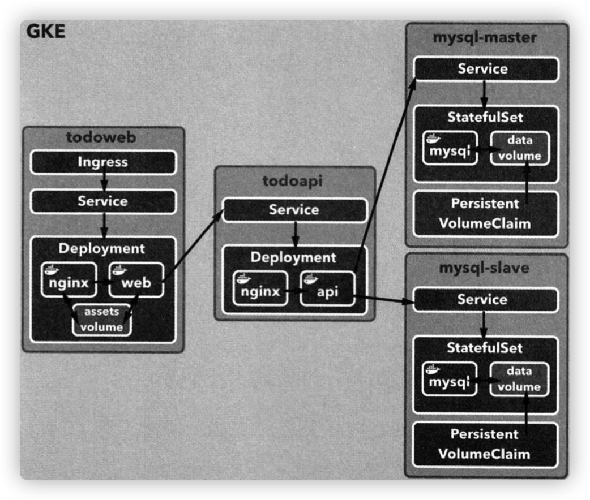

# 쿠버네티스 클러스터 구축

- [쿠버네티스 클러스터 구축](#쿠버네티스-클러스터-구축)
- [1. Google Kubernetes Engine 환경 설정](#1-google-kubernetes-engine-환경-설정)
  - [1.1. GCP 프로젝트 생성](#11-gcp-프로젝트-생성)
  - [1.2. 구글 클라우드 SDK(gcloud) 설치](#12-구글-클라우드-sdkgcloud-설치)
  - [1.3. 쿠버네티스 클러스터 생성](#13-쿠버네티스-클러스터-생성)
- [2. GKE 에 TODO 애플리케이션 구축](#2-gke-에-todo-애플리케이션-구축)
- [3. GKE 에 MySQL 을 마스터-슬레이브 구성으로 구축](#3-gke-에-mysql-을-마스터-슬레이브-구성으로-구축)
  - [3.1. 퍼시스턴스볼륨과 퍼시스턴트볼륨클레임](#31-퍼시스턴스볼륨과-퍼시스턴트볼륨클레임)
  - [3.2. 스토리지클래스(StorageClass)](#32-스토리지클래스storageclass)
  - [3.3. 스테이트풀세트(StatefulSet)](#33-스테이트풀세트statefulset)

# 1. Google Kubernetes Engine 환경 설정

이번 장에선 4 장에서 구축했던 TODO 애플리케이션을 쿠버네티스로 전환하고 GKE 를 사용해서 배포할 예정

GKE 사용 준비
1. 프로젝트 생성
2. GCP 명령행 도구인 구글 클라우드 SDK 설치
3. GKE 에 새로운 쿠버네티스 클러스터 구축

<br>

## 1.1. GCP 프로젝트 생성

- https://console.cloud.google.com/kubernetes/ 에 접속해서 계정을 생성
- 클라우드 콘솔에서 `gihyo-kuber` 라는 이름으로 새로운 프로젝트 생성
  - 프로젝트명은 중복가능성이 있어서 프로젝트ID 가 추가로 붙음

<br>

## 1.2. 구글 클라우드 SDK(gcloud) 설치

- https://cloud.google.com/sdk/docs/quickstart 설치 가이드 참조

```sh
$ gcloud components update
$ gcloud auth login

# 조작 대상 프로젝트 ID 세팅
$ gcloud config set project gihyo-kuber-317012

# 기본 리전 설정
$ gcloud config set compute/zone asia-northeast2-a
```

<br>

## 1.3. 쿠버네티스 클러스터 생성

study 라는 이름의 클러스터 생성 후 `kubectl` 에 인증 정보 세팅

```sh
# study 라는 이름의 쿠버네티스 클러스터 생성
$ gcloud container clusters create study --machine-type=n1-standard-1 --num-nodes=3

# 클러스터 정보 확인 (클라우드 콘솔에서도 확인 가능)
$ gcloud container clusters describe study

# gcloud 로 클러스터를 제어할 수 있도록 kubectl 에 인증 정보 설정
$ gcloud container clusters get-credentials study

# kubectl 명령으로 노드 목록이 확인되는지 테스트
$ kubectl get nodes
NAME                                   STATUS   ROLES    AGE     VERSION
gke-study-default-pool-1cdd065e-28p1   Ready    <none>   2m20s   v1.19.9-gke.1900
gke-study-default-pool-1cdd065e-k5s1   Ready    <none>   2m20s   v1.19.9-gke.1900
gke-study-default-pool-1cdd065e-r4dt   Ready    <none>   2m20s   v1.19.9-gke.1900
```

<br>

# 2. GKE 에 TODO 애플리케이션 구축

4 장에서 만들었던 TODO 애플리케이션을 다음 그림과 같이 클라우드에 구축해보자



<br>

# 3. GKE 에 MySQL 을 마스터-슬레이브 구성으로 구축

**표준 데이터 볼륨의 한계**
- 퍼시스턴스 데이터를 다루는 컨테이너를 도커로 실행할 때는 데이터 볼륨 사용
- 표준 데이터 볼륨은 컨테이너가 배포된 호스트에 위치해야함
- 호스트 간에 컨테이너를 재배치하는 과정이 번거로움

**쿠버네티스의 해결법**
- 호스트에서 분리할 수 있는 외부 스토리지를 볼륨으로 사용 가능
- 파드가 다른 호스트에 재배치돼도 외부 스토리지 형태의 볼륨은 새로 배치된 호스트에 자동으로 할당
- 호스트와 데이터 볼륨의 결합이 느슨해져서 운영하기 편함

**쿠버네티스 리소스**
- 퍼시스턴트볼륨(PersistentVolume)
- 퍼시스턴트볼륨클레임(PersistentVolumeClaim)
- 스토리지클래스(StorageClass)
- 스테이트풀세트(StatefulSet) 

<br>

## 3.1. 퍼시스턴스볼륨과 퍼시스턴트볼륨클레임

**예제에서는 사용하지 않음

- 퍼시스턴스볼륨: 스토리지 그자체
- 퍼시스턴스볼륨클레임: 추상화된 논리 리소스로, 퍼시스턴스볼륨과 달리 용량을 필요한 만큼 동적으로 확보 가능

**퍼시스턴스볼륨클레임 리소스의 매니페스트 파일**

```yaml
apiVersion: v1
kind: PersistentVolumeClaim
metadata:
name: pvc-example
spec:
  accessModes:
    - ReadWriteOnce
  storageClassName: ssd # StorageClass 리소스 종류
  resources:
    requests :
      storage: 4Gi
```

- `accessModes`
  - 파드가 스토리지에 접근하는 방식 지정
  - `ReadWriteOnce`: 마운트(읽기/쓰기)될 수 있는 노드를 하나로 제한
  - `ReadOnlyMany` 또는 `ReadWriteMany` 는 제한이 없는 대신 플랫폼에 따라 사용할 수 없는 경우도 있음
- `storageClassName`
  - `StorageClass` 리소스의 종류
  - 어떤 스토리지를 사용할 지 정의

<br>

## 3.2. 스토리지클래스(StorageClass)

- https://kubernetes.io/ko/docs/concepts/storage/storage-classes/ 참조
- 퍼시스턴스볼륨으로 확보한 스토리지의 종류를 정의하는 리소스
- GCP 스토리지 종류는 2 가지
  - '표준'
  - 'SSD'

**`storage-class-ssd.yaml` 매니페스트 파일 작성**

```yaml
kind: StorageClass
apiVersion: storage.k8s.io/v1
metadata:
  name: ssd # storageClassName 지정
  annotations:
    storageclass.kubernetes.io/is-default-class: "false"
  labels:
    kubernetes.io/cluster-service: "true"
provisioner: kubernetes.io/gce-pd # GCP의 프로비저너인 gce-pd 로 지정
parameters:
  type: pd-ssd # 타입은 pd-ssd
```

**스토리지클래스 생성**
```sh
$ kubectl apply -f storage-class-ssd.yaml
storageclass.storage.k8s.io/ssd created
```

<br>

## 3.3. 스테이트풀세트(StatefulSet)

- Deployment 하나만 있으면 되는 파드 혹은 퍼시스턴스 데이터를 갖지 않는 Stateless 애플리케이션을 배포하는 데 적합
- 데이터 스토어처럼 데이터를 계속 유지하는 Stateful 애플리케이션을 관리하는 데 적합
  - 무작위로 생성되는 Deployment 파드와 달리 `pod-0`, `pod-1` 처럼 일정한 식별자가 붙음
  - 식별자가 안정적이기 때문에 파드가 재생성 되어도 스토리지가 계속 같은 파드에 연결됨

<br>

여기서부터는 todoweb 만드는건데 mysql yaml 에서 막혀서 나중에 추가 필요..
