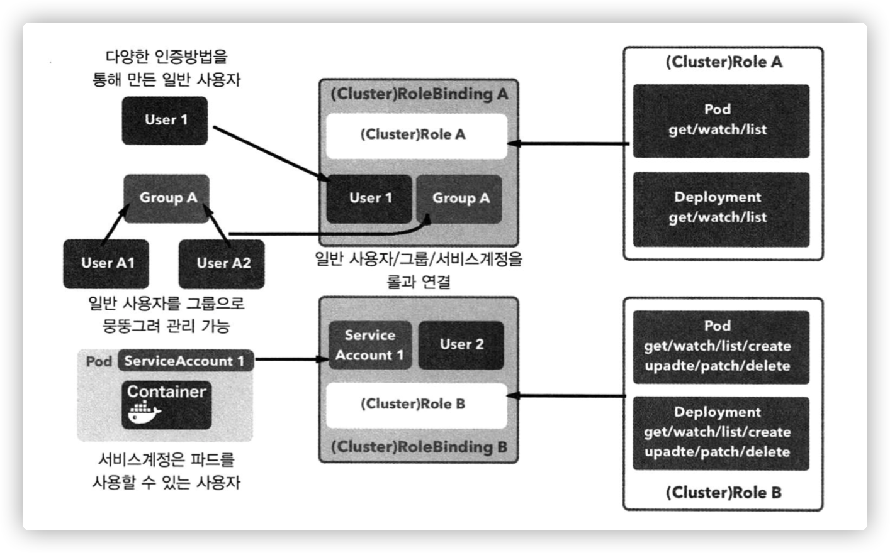
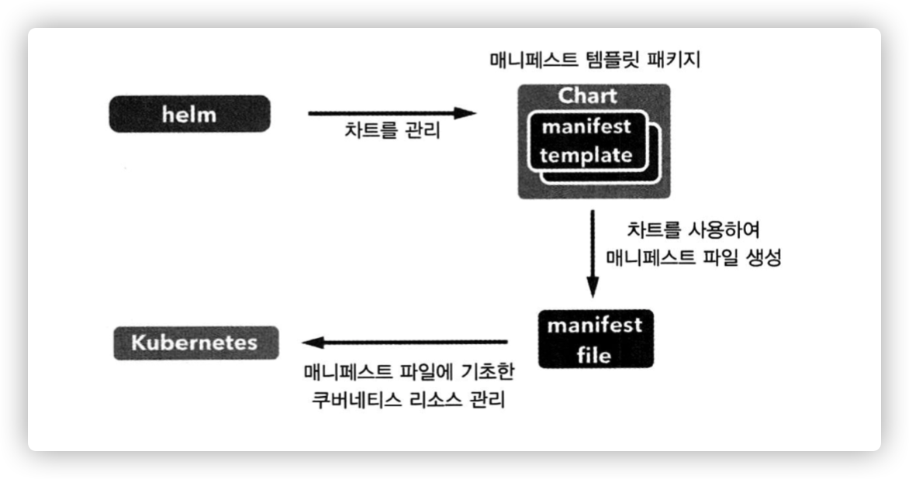

# 쿠버네티스 실전편

- [쿠버네티스 실전편](#쿠버네티스-실전편)
- [1. 쿠버네티스의 그 외 리소스](#1-쿠버네티스의-그-외-리소스)
- [1.1. 잡 (Job)](#11-잡-job)
- [1.2. 크론잡 (CronJob)](#12-크론잡-cronjob)
  - [1.3. 시크릿](#13-시크릿)
- [2. 사용자 관리와 RBAC](#2-사용자-관리와-rbac)
  - [2.1. RBAC 를 이용한 권한 제어](#21-rbac-를-이용한-권한-제어)
- [3. 헬름](#3-헬름)
  - [3.1. 헬름의 주요 개념](#31-헬름의-주요-개념)
  - [헬름 3 버전의 변화](#헬름-3-버전의-변화)
  - [3.2. 헬름 설치](#32-헬름-설치)
  - [헬름 차트 레포지토리 추가](#헬름-차트-레포지토리-추가)
  - [3.2. 차트 설치하기](#32-차트-설치하기)
  - [3.3. 차트로 설치한 애플리케이션 제거하기](#33-차트로-설치한-애플리케이션-제거하기)
  - [3.4. RBAC 를 지원하는 애플리케이션 설치하기](#34-rbac-를-지원하는-애플리케이션-설치하기)
  - [3.5. 사용자 차트 생성하기](#35-사용자-차트-생성하기)
  - [3.6. 차트 사용자 레포지토리 구축](#36-차트-사용자-레포지토리-구축)

# 1. 쿠버네티스의 그 외 리소스

지금까지 살펴본 리소스
- 파드
- 레플리카세트
- 디플로이먼트
- 서비스
- 인그레스

데몬으로 동작하는 서버 애플리케이션을 구축할 때 사용하는 기본 리소스

쿠버네티스는 이 외에도 배치 서버 등 다양한 형태의 애플리케이션 구축 가능

<br>

# 1.1. 잡 (Job)

하나 이상의 파드를 생성해 지정된 수의 파드가 정상 종료될 때까지 이를 관리하는 리소스

잡이 생성한 파드는 정상 종료된 후에도 삭제되지 않음
- 종료 후 파드의 로그나 실행 결과 분석 가능
- 데몬형 애플리케이션 보다는 배치 작업 위주의 애플리케이션에 적합

<br>

**매니페스트 파일 정의**

```yaml
# simple-job.yaml

apiVersion: batch/v1
kind: Job
metadata:
  name: pingpong
  labels:
    app: pingpong
spec:
  parallelism: 3
  template:
    metadata:
      labels:
        app: pingpong
    spec:
      containers:
      - name: pingpong
        image: gihyodocker/alpine:bash
        command: ["/bin/sh"]
        args:
          - "-c"
          - |
            echo [`date`] ping!
            sleep 10
            echo [`date`] pong!
      restartPolicy: Never
```

- "ping!" 을 출력한 다음 10초 후에 다시 "pong!" 을 출력한 후 종료
- `spec.template` 아래의 정의는 파드와 같음
- `spec.parallelism`
  - 동시에 실행하는 파드의 수를 지정
  - 파드를 병렬로 실행해야 할 때 편리
- `restartPolicy`
  - 파드 종료 후 재실행 여부 설정
  - 잡 리소스는 이 속성을 `Always` (파드가 종료되면 재실행) 로 설정 불가능 (파드는 이 값이 원래 기본)
  - 잡 리소느는 `Never` (실패 시 파드를 재생성해 실행) 또는 `OnFailure` (실패한 파드를 재실행) 로 설정해야함

<br>

**파드 실행**

```sh
# 잡 파드 실행
$ kubectl apply -f simple-job.yaml
job.batch/pingpong created


# 로그 확인
$ kubectl logs -l app=pingpong
[Wed Jun 16 15:13:59 UTC 2021] ping!
[Wed Jun 16 15:14:09 UTC 2021] pong!
[Wed Jun 16 15:14:04 UTC 2021] ping!
[Wed Jun 16 15:14:14 UTC 2021] pong!
[Wed Jun 16 15:14:02 UTC 2021] ping!
[Wed Jun 16 15:14:12 UTC 2021] pong!


# 파드 종료 확인
$ kubectl get pod
NAME             READY   STATUS      RESTARTS   AGE
pingpong-7l22p   0/1     Completed   0          76s
pingpong-8p44w   0/1     Completed   0          76s
pingpong-g2b6n   0/1     Completed   0          76s
```

<br>

# 1.2. 크론잡 (CronJob)

잡 리소스는 파드가 단 한번만 실행

크론잡 리소스는 스케줄을 지정해 정기적으로 파드 실행
- 덕분에 Cron 을 사용한 이벤트 애플리케이션을 따로 만들지 않아도 됨
- 컨테이너 친화적인 특성을 유지하면서 스케줄에 따른 작업 수행 가능

<br>

**매니페스트 파일 정의**

```yaml
# simple-cronjob.yaml

apiVersion: batch/v1beta1
kind: CronJob
metadata:
  name: pingpong
spec:
  schedule: "*/1 * * * *"
  jobTemplate:
    spec:
      template:
        metadata:
          labels:
            app: pingpong
        spec:
          containers:
          - name: pingpong
            image: gihyodocker/alpine:bash
            command: ["/bin/sh"]
            args:
              - "-c"
              - |
                echo [`date`] ping!
                sleep 10
                echo [`date`] pong!
          restartPolicy: OnFailure
```

- Job 매니페스트와의 가장 큰 차이점은 `spec.schedule` 속성에 cron 처럼 스케줄 정의 가능

<br>

**파드 실행**

```sh
$ kubectl apply -f simple-cronjob.yaml
Warning: batch/v1beta1 CronJob is deprecated in v1.21+, unavailable in v1.25+; use batch/v1 CronJob
cronjob.batch/pingpong created

$ kubectl get job -l app=pingpong
```

<br>

## 1.3. 시크릿

기밀 정보 문자열을 Base64 인코딩으로 만들 수 있음

<br>

**사용자명과 패스워드 암호화**

```sh
# echo "<사용자명>:$(openssl passwd -quiet -crypt <패스워드>)" | base64
$ echo "woody:$(openssl passwd -quiet -crypt 1212qwqw)" | base64
d29vZHk6cFp4U2k4RWVTMTB5TQo=
```

<br>

**매니페스트 파일 작성**

```yaml
# nginx-secret.yaml

apiVersion: v1
kind: Secret
metadata:
  name: nginx-secret
type: Opaque
data:
  .htpasswd: d29vZHk6cFp4U2k4RWVTMTB5TQo=    # Base64로 변환된 암호화된 문자열
```

<br>

**리소스 생성**

```sh
$ kubectl apply -f nginx-secret.yaml
secret/nginx-secret created
```

<br>

# 2. 사용자 관리와 RBAC

**쿠버네티스의 사용자 개념**
- 일반 사용자 (normal user)
  - 클러스터 외부에서 쿠버네티스를 조작하는 사용자, 다양한 방법으로 인증을 거침
  - 개발자 및 운영 실무자
  - 일반 사용자를 분류하는 그룹 개념도 있어서 이 그룹 단위로 권한을 부여할 수도 있음
  - 배포와 관련된 서비스나 디플로이먼트의 접근 권한을 일부 사용자에게만 허용
  - 파드의 로그 열람 권한을 다른 일반 사용자에게도 허용
- 서비스 계정 (service account)
  - 쿠버네티스 내부적으로 관리되며 파드가 쿠버네티스 API 를 다룰 때 사용하는 사용자
  - 쿠버네티스 리소스의 일종
  - 애플리케이션을 통해 쿠버네티스 조작을 통제 가능
  - 클러스터 안에서 봇을 동작시키는 파드에 권한을 부여해두고, 이 봇으로 기존 디플로이먼트를 업데이트 하거나 레플리카 수를 조절하는 식으로 활용 가능

**RBAC (rol-based access control)**
- 서비스 계정 및 일반 사용자의 권한을 제어
- 롤에 따라 리소스에 대한 권한을 제어하는 기능이자 개념
- 적절히 사용해 쿠버네티스 리소스의 보안을 확보 가능

<br>

## 2.1. RBAC 를 이용한 권한 제어

**권한 제어 요소**
- 롤(role): 어떤 쿠버네티스 API 를 사용할 수 있는지 정의
- 바인딩(binding): 롤을 일반 사용자 및 그룹, 그리고 서비스 계정과 연결



|      리소스      | 내용                                                                     |
| :--------------: | ------------------------------------------------------------------------ |
|        롤        | 각 쿠버네티스 API 의 사용 권한을 정의. 지정된 네임스페이스 안에서만 유효 |
|     롤바인딩     | 일반 사용자 및 그룹/서비스 계정과 롤을 연결                              |
|    클러스터롤    | 각 쿠버네티스 API 의 사용 권한을 정의. 클러스터 전체에서 유효            |
| 클러스터롤바인딩 | 일반 사용자 및 그룹/서비스 계정과 클러스터롤을 연결                      |

<br>

# 3. 헬름

애플리케이션을 여러 클러스터에 배포해야 하는 경우가 많음

매니페스트 파일을 클러스터 개수만큼 작성해서 환경에 따라 달리 적용하며 배포하기는 쉽지 않음

**배포 환경에 따라 달라지는 설정값만 정의해둔 다음 이에 따라 배포하는 메커니즘이 필요**

<br>

```html
Helm is a tool for managing Kubernetes charts. Charts are packages of pre-configured Kubernetes resources.

헬름은 쿠버네티스 차트를 관리하기 위한 도구다. 차트는 사전 구성된 쿠버네티스 리소스의 패키지다.
```

<br>

**헬름이란?**
- 쿠버네티스 하위 프로젝트로 관리되는 공식 도구
- 패키지 관리 도구고, 차트가 리소스를 하나로 묶은 패키지에 해당
- 자칫 번잡해지기 쉬운 매니페스트 파일을 관리하기 쉽게 차트로 관리
- 차트를 중심으로 하는 쿠버네티스 개발 업무의 종합 관리 도구
- 실무에서는 여러 환경에 배포해야 하는 애플리케이션은 모두 차트로 패키징해 `kubectl` 대신 헬름으로 배포 및 업데이트를 수행
  - 대신 `kubectl` 은 이미 배포된 리소스를 운영 중에 수정하는데 사용



<br>

## 3.1. 헬름의 주요 개념

- 차트 (charts)
  - 매니페스트 파일을 생성하는 템플릿을 여러 개 패키징 한 것
  - 쿠버네티스 클러스터 내에서 애플리케이션, 도구, 서비스를 구동하는데 필요한 모든 리소스 정의가 포함
- 저장소 (repository)
  - 차트를 모아두고 공유하는 장소
- 릴리즈 (release)
  - 쿠버네티스 클러스터에서 구동되는 차트의 인스턴스
  - 일반적으로 하나의 차트는 동일한 클러스터내에 여러 번 설치 가능
  - 설치될 때마다, 새로운 release 가 생성

MySQL 차트의 경우를 생각

클러스터 내에 데이터베이스 2대를 구동하려면, 차트를 두번 설치

차례로 각각의 release 와 release name 을 가지게 됨

헬름은 쿠버네티스 내부에 charts 를 설치하고, 각 설치에 대해 새로운 release 를 생성한다. 새로운 차트를 찾기 위해 헬름 차트 repositories 를 검색할 수 있다.

<br>

**차트의 구성**

```sh
SampleApp/
|__Chart.yaml          # 차트에 대한 정보를 가지고 있음.
|__values.yaml         # 이 차트에서 사용하는 기본 설정 값
|__charts/             # 이 차트에 관련되어 있는 차트들
|__templates/          # 쿠버네티스 매니페스트 파일들로 변환될 YAML 템플릿 파일들
```

<br>

## 헬름 3 버전의 변화

2019-11-13일 v3.0.0이 release 되면서 많은 변화가 존재

변화 내용 참조: https://helm.sh/ko/docs/topics/v2_v3_migration/


**Tiller 제거:**
- 클라이언트/서버 구조는 클라이언트/라이브러리 아키텍처로 대체됨 (helm 바이너리만 해당)
- 보안 서비스는 이제 사용자 단위로 제공됨 (쿠버네티스 사용자 클러스터 보안에 위임)
- 릴리스는 이제 클러스터 내의 시크릿으로 저장되고 릴리스 객체 메타 데이터도 변경됨
- 릴리스는 더 이상 Tiller 네임스페이스가 아니라 릴리스 네임스페이스 기반으로 유지됨

**차트 저장소 업데이트:**
- helm search 는 이제 로컬 저장소 검색과 헬름 허브에 대한 검색 쿼리를 모두 지원함

**다음의 사양 변경에 대하여 차트 apiVersion 이 "v2"로 증가:**
- 동적으로 연결된 차트 의존성이 Chart.yaml 로 이동됨 (requirements.yaml 제거되고, 요구사항(requirements) --> 의존성(dependencies)으로 변경)
- 라이브러리 차트(헬퍼/공통 차트)를 동적으로 연결된 차트 의존성으로 추가 가능
- 차트를 application 또는 library 차트로 정의하는 type 메타 데이터 필드를 가짐. 기본값은 application이며 렌더링 및 설치 가능하다는 의미
-헬름 2 차트 (apiVersion=v1) 도 여전히 설치 가능함

**XDG 디렉토리 사양 추가:**
- 헬름 홈이 제거되고 구성 파일 저장을 위한 XDG 디렉토리 사양으로 대체
- 헬름 초기화 불필요
- helm init 와 helm home 명령어 제거

**Helm 설치/설정 단순화:**
- 헬름 클라이언트 (헬름 바이너리) 만 있으면 됨 (Tiller 불필요)
- Run-as-is 패러다임
- local 또는 stable 저장소는 기본적으로 미설정

**제거/교체/추가 된 명령어:**
- delete --> uninstall : 기본적으로 모든 릴리스 기록 제거 (예전에는 --purge 옵션이 필요했음)
- fetch --> pull
- home (제거됨)
- init (제거됨)
- install: 릴리스 이름 또는 --generate-name 인수 필요
- inspect --> show
- reset (제거됨)
- serve (제거됨)
- template: -x/--execute 인수의 이름이 -s/--show-only 로 변경
- upgrade: 릴리스당 저장되는 최대 리비젼 수를 제한하는 인수 --history-max 추가됨 (0은 무제한)

<br>

## 3.2. 헬름 설치

[설치 가이드](https://helm.sh/ko/docs/intro/install/) 참고

```sh
# 설치
$ brew install helm

# 버전확인
$ helm version
version.BuildInfo{Version:"v3.6.0", GitCommit:"7f2df6467771a75f5646b7f12afb408590ed1755", GitTreeState:"dirty", GoVersion:"go1.16.4"}
```

<br>

## 헬름 차트 레포지토리 추가

```sh
# 레포지토리 추가하기 (공식 헬름 stable 차트)
$ helm repo add stable https://charts.helm.sh/stable
"stable" has been added to your repositories


# 헬름에서 사용 가능한 레포지토리
$ helm repo ls
NAME  	URL
stable	https://charts.helm.sh/stable


# stable 레포에서 설치할 수 있는 차트 목록
$ helm search repo stable
NAME                                 	CHART VERSION	APP VERSION            	DESCRIPTION
stable/acs-engine-autoscaler         	2.2.2        	2.1.1                  	DEPRECATED Scales worker nodes within agent pools
stable/aerospike                     	0.3.5        	v4.5.0.5               	DEPRECATED A Helm chart for Aerospike in Kubern...
stable/airflow                       	7.13.3       	1.10.12                	DEPRECATED - please use: https://github.com/air...
stable/ambassador                    	5.3.2        	0.86.1                 	DEPRECATED A Helm chart for Datawire Ambassador
stable/anchore-engine                	1.7.0        	0.7.3                  	Anchore container analysis and policy evaluatio...
...
```

<br>

여기서는 redmine 을 예제로 설치해볼 예정

**그러나 stable repo 에서 redmine 은 deprecated 되었음**

https://github.com/helm/charts/tree/master/stable/redmine 를 보고 확인해보면 `stable` 대신 `bitnami` 를 사용해야 한다고 함

```sh
# bitnami repo 추가
$ helm repo add bitnami https://charts.bitnami.com/bitnami
"bitnami" has been added to your repositories


# repo 추가 확인
$ helm repo ls
NAME   	URL
stable 	https://charts.helm.sh/stable
bitnami	https://charts.bitnami.com/bitnami
```

<br>

## 3.2. 차트 설치하기

```sh
# helm install <릴리즈명> <repo>/<chart>
$ helm install my-release bitnami/redmine
```

- `helm install` 명령어로 설치 가능
- 설치한 애플리케이션을 업데이트하거나 삭제하려면 릴리즈 네임이 필요
- 그냥 설치하면 차트에 포함된 [기본값 value](https://github.com/helm/charts/blob/master/stable/redmine/values.yaml) 파일에 정의된 설정값으로 설치됨
  - 그러나 대부분은 그대로 사용하지 않고 커스터마이징 해서 사용함

<br>

**커스텀 value 파일 생성**

```yaml
# redmine.yaml

redmineUsername: woody
redminePassword: woody
redmineLanguage: ko

service:
  type: NodePort
```

- 인증정보 설정을 담은 파일 작성

<br>

**커스텀 value 반영해서 설치**

```sh
# 설치
$ helm install redmine -f redmine.yaml bitnami/redmine


# 확인
$ helm ls
NAME   	NAMESPACE	REVISION	UPDATED                             	STATUS  	CHART          	APP VERSION
redmine	default  	1       	2021-06-17 04:11:17.676563 +0900 KST	deployed	redmine-15.2.20	4.2.1


# 서비스 확인
$ kubectl get svc,deploy
NAME                      TYPE        CLUSTER-IP      EXTERNAL-IP   PORT(S)        AGE
service/kubernetes        ClusterIP   10.96.0.1       <none>        443/TCP        26h
service/redmine           NodePort    10.111.52.170   <none>        80:30615/TCP   61s
service/redmine-mariadb   ClusterIP   10.97.182.131   <none>        3306/TCP       61s

NAME                      READY   UP-TO-DATE   AVAILABLE   AGE
deployment.apps/redmine   0/1     1            0           61s
```

- `-f` 옵션으로 커스텀 value 파일 (redmine.yaml) 을 지정해서 레드마인 설치

<br>

**upgrade**

만약 차트나 커스텀 value 파일이 수정된 경우에 릴리즈를 업데이트 하려면 `helm upgrade` 명령어를 사용하면 됨

- `helm upgrade redmine -f redmine.yaml bitnami/redmine`

<br>

## 3.3. 차트로 설치한 애플리케이션 제거하기

**완전히 제거**

```sh
$ helm uninstall redmine
release "redmine" uninstalled


# 삭제한 릴리즈까지 전부 확인
$ helm ls --all
NAME   	NAMESPACE	REVISION	UPDATED                            	STATUS     	CHART          	APP VERSION
```

<br>

**롤백을 위해 릴리즈 남겨두기**

```sh
# --keep-history 옵션을 붙이면 릴리즈 남겨둠
$ helm uninstall redmine --keep-history
release "redmine" uninstalled


# 삭제한 릴리즈까지 전부 확인
$ helm ls --all
NAME   	NAMESPACE	REVISION	UPDATED                            	STATUS     	CHART          	APP VERSION
redmine	default  	1       	2021-06-17 04:59:45.92886 +0900 KST	uninstalled	redmine-15.2.20	4.2.1


# REVISION 값을 보고 롤백 가능
$ helm rollback redmine 1
Rollback was a success! Happy Helming!
```

<br>

## 3.4. RBAC 를 지원하는 애플리케이션 설치하기

v2 에서 v3 으로 넘어가면서 `Tiller` 가 완전히 삭제되면서 개념이 조금 바뀜

[블로그](https://kycfeel.github.io/2019/12/25/Helm-v2-%EC%97%90%EC%84%9C-v3-%EB%A1%9C-%EB%A7%88%EC%9D%B4%EA%B7%B8%EB%A0%88%EC%9D%B4%EC%85%98-%ED%95%98%EA%B8%B0/) 글을 참고해보면 아래와 같다.

```text
Helm v3부터는 Tiller 가 아닌 쿠버네티스 API를 사용해 설치된 Helm Chart들을 쿠버네티스 그 자체에 저장하게 된다.
그 Chart를 설치하는 RBAC 권한은 사용자가 사용한 kubeconfig 파일을 따라가게 된다.
```

<br>

https://helm.sh/ko/docs/topics/rbac/ 공식 사이트에 RBAC 에 나와있음

```sh
# 서비스 계정 생성
$ kubectl create serviceaccount --namespace kube-system tiller

serviceaccount/tiller created


# 권한 부여
$ kubectl create clusterrolebinding tiller-cluster-rule \
  --clusterrole=cluster-admin \
  --serviceaccount kube-system:tiller

clusterrolebinding.rbac.authorization.k8s.io/tiller-cluster-rule created
```

<br>

jenkins 설치를 따라해보려 했으나 values.yaml 에 `rbac` 라는 속성이 없어져서 동작 안하는 것 같음

stable 레포에 jenkins 도 없음

<br>

## 3.5. 사용자 차트 생성하기

쿠버네티스에서 동작하는 대부분의 애플리케이션은 서비스, 인그레스, 디플로이먼트 같은 쿠버네티스 리소스로 구성

차트는 이 구성을 추상화하고 패키징해 배포하기 위한 것

매니페스트 파일을 복사해 하나 이상의 환경에 배포하는 방식보다 유지 보수성이 좋음

3장에서 다룬 nginx 와 echo 로 구성된 애플리케이션 차트를 만들어보자

<br>

**로컬 레포지토리 활성화하기**

v3 은 기본적으로 로컬 레포지토리가 없음

그리고 `helm serve` 가 [v3 에서 제거](https://helm.sh/ko/docs/faq/#helm-serve-%EC%A0%9C%EA%B1%B0)됨

<br>

**차트 템플릿 작성**

차트 생성하려면 차트의 디렉토리 구조를 만들어야 함. 헬름에 템플릿을 만들어주는 기능이 있음

```sh
# 차트 템플릿 생성
$ helm create echo
Creating echo


# 차트 템플릿 디렉토리 구조 확인
❯ tree .
.
└── echo
    ├── Chart.yaml
    ├── charts
    ├── templates
    │   ├── NOTES.txt
    │   ├── _helpers.tpl
    │   ├── deployment.yaml
    │   ├── hpa.yaml
    │   ├── ingress.yaml
    │   ├── service.yaml
    │   ├── serviceaccount.yaml
    │   └── tests
    │       └── test-connection.yaml
    └── values.yaml

4 directories, 10 files
```

<br>

**디플로이먼트**

헬름 템플릿에 자동 생성된 `deployment.yaml` 이 있음

일단 헬름 템플릿 파일은 잠시 잊고 필요한 디플로이먼트를 만들기 위해서는 어떻게 매니페스트 파일을 작성해야 할지 생각해보자

```yaml
# 기존의 deployment.yaml

apiVersion: apps/v1
kind: Deployment
metadata:
  name: echo
  labels:
    app: echo
spec:
  replicas: 1
  selector:
    matchLabels:
      app: echo
  template:
    metadata:
      labels:
        app: echo
    spec: # 수정이 필요한 부분은 여기부터 (파드 정의 템플릿)
      containers:
      - name: nginx
        image: "gihyodocker/nginx:latest"
        imagePullPolicy: Always
        livenessProbe:
          httpGet:
            path: /
            port: 80
        readinessProbe:
          httpGet:
            path: /
            port: 80
        ports:
          - name: http
          containerPort: 80
        env:
          - name: BACKEND_HOST
          value: "localhost:8080"
      - name: echo
        image: "gihyodocker/echo:latest"
        imagePullPolicy: Always
        ports:
          - containerPort: 8080
        env:
          - name: HTTP_PORT
          value: "8080"
```

- 헬름이 자동 생성해준 파일로도 이 구성을 그대로 작성 가능
- 수정이 필요한 부분은 `spec.template.spec`
- 자동 생성된 파일에는 `containers` 의 자식 요소가 하나뿐이므로 nginx, echo 2개의 컨테이너 정의를 작성
- 각 컨테이너의 설정값은 기본값 value 파일의 변수를 참조

<br>

```yaml
# 헬름 템플릿의 deployment.yaml

apiVersion: apps/v1
kind: Deployment
metadata:
  name: {{ include "echo.fullname" . }}
  labels:
    {{- include "echo.labels" . | nindent 4 }}
spec:
  {{- if not .Values.autoscaling.enabled }}
  replicas: {{ .Values.replicaCount }}
  {{- end }}
  selector:
    matchLabels:
      {{- include "echo.selectorLabels" . | nindent 6 }}
  template:
    metadata:
      {{- with .Values.podAnnotations }}
      annotations:
        {{- toYaml . | nindent 8 }}
      {{- end }}
      labels:
        {{- include "echo.selectorLabels" . | nindent 8 }}
    spec:
      {{- with .Values.imagePullSecrets }}
      imagePullSecrets:
        {{- toYaml . | nindent 8 }}
      {{- end }}
      serviceAccountName: {{ include "echo.serviceAccountName" . }}
      securityContext:
        {{- toYaml .Values.podSecurityContext | nindent 8 }}
      containers: # 여기 하위로 nginx 와 echo 를 추가
        - name: nginx
          image: "{{ .Values.nginx.image.repository }}:{{ .Values.nginx.image.tag | default .Chart.AppVersion }}"
          imagePullPolicy: {{ .Values.nginx.image.pullPolicy }}
          ports:
            - name: http
              containerPort: 80
          livenessProbe:
            httpGet:
              path: {{ .Values.nginx.healthCheck }}
              port: 80
          readinessProbe:
            httpGet:
              path: {{ .Values.nginx.healthCheck }}
              port: 80
          env:
            - name: BACKEND_HOST
            value: {{ .Values.nginx.backendHost | quote }}
        - name: echo
          image: "{{ .Values.echo.image.repository }}:{{ .Values.echo.image.tag | default .Chart.AppVersion }}"
          imagePullPolicy: {{ .Values.echo.image.pullPolicy }}
          ports:
            - containerPort: {{ .Values.echo.httpPort }}
          env:
            - name: HTTP_PORT
              value: {{ .Values.echo.httpPort | quote }}
          resources: {{- toYaml .Values.resources | nindent 12 }}
      {{- with .Values.nodeSelector }}
      nodeSelector:
        {{- toYaml . | nindent 8 }}
      {{- end }}
      {{- with .Values.affinity }}
      affinity:
        {{- toYaml . | nindent 8 }}
      {{- end }}
      {{- with .Values.tolerations }}
      tolerations:
        {{- toYaml . | nindent 8 }}
      {{- end }}
```

- 이렇게 과도하게 추상화하면 애플리케이션을 원하는 대로 조절하기 힘듬
- 여기서 사용한 nginx 컨테이너처럼 딱 정해진 포트 80 만으로 노출하는 컨테이너도 있음
  - 외부로 배포할 차트가 아니라면 직접 80펀 보트를 기재해 추상화 수준을 타협하는 것도 좋음
- 템플릿에 기본값을 설정하는 것도 한가지 방법

```yaml
ports:
  - name: http
    containerPort: {{ .Values.nginx.port | default "80" }} # 기본값
```

<br>

**기본값 value 파일**

```yaml
replicaCount: 1

nginx:
  image:
    repository: gihyodocker/nginx
    tag: latest
    pullPolicy: Always
  healthCheck: /
  backendHost: localhost:8080

echo:
  image:
    repository: gihyodocker/echo
    tag: latest
    pullPolicy: Always
  httpPort: 8080
```

- 위 `deployment.yaml` 에서 `.Values` 로 시작하는 변수를 포맷화한다

<br>

**서비스**

```yaml
# 헬름 템플릿의 service.yaml

apiVersion: v1
kind: Service
metadata:
  name: {{ include "echo.fullname" . }}
  labels:
    {{- include "echo.labels" . | nindent 4 }}
spec:
  type: {{ .Values.service.type }}
  ports:
    - port: {{ .Values.service.port }}
      targetPort: http
      protocol: TCP
      name: {{ .Values.service.name }}
  selector:
    app: {{- include "echo.name" . | nindent 4 }}
```

- 서비스의 포트를 nginx 컨테이너의 포트로 포워딩

<br>

기본값 value 파일에서 service 부분은 다음과 같음

```yaml
service:
  name: nginx
  type: ClusterIp
  externalPort: 80
```

<br>

**인그레스**

기본값 `values.yaml` 파일에 정의되어 있는 ingress 설정

```yaml
ingress:
  enabled: false
  className: ""
  annotations: {}
    # kubernetes.io/ingress.class: nginx
    # kubernetes.io/tls-acme: "true"
  hosts:
    - host: chart-example.local
      paths:
        - path: /
          pathType: ImplementationSpecific
  tls: []
  #  - secretName: chart-example-tls
  #    hosts:
  #      - chart-example.local
```

- `ingress.enabled` 값이 true 가 아니면 파일이 생성되지 않음
- 인그레스는 배포 환경에 따라 커스터마이징이 많이 발생
- 쿠버네티스 클러스터가 동작하는 플랫폼에 의존하는 면이 크기 때문에 대부분의 차트에서 비활성 상태
- 지금 상태 그대로 두면 됨

<br>

**차트 패키징**

`Chart.yaml` 파일에 차트의 이름과 버전을 정의 가능`

```yaml
apiVersion: v2
description: A Helm chart for Kubernetes
name: echo
version: 0.1.0
```

- `version` 속성값은 0.1.0 처럼 시맨틱 버전 형식 또는 2 같은 자연수 형식
  - 수정된 차트를 다시 패키징 할 때마다 값을 늘려가면 됨
- 패키징은 완성된 차트가 위치한 디렉토리를 지정하면 됨
  - 이름은 `echo` 고 버전이 `0.1.0` 이므로 `echo-0.1.0.tgz` 라는 이름으로 패키징됨

<br>

```sh
$ helm package echo
Successfully packaged chart and saved it to: /Users/kakao/Documents/practice-codes/practice-kubernetes/example-helm/echo-0.1.0.tgz
```

<br>

## 3.6. 차트 사용자 레포지토리 구축

차트 아카이브 파일 (.tgz) 과 레포지토리에 등록된 차트의 정보를 모아둔 인덱스 파일 (index.yaml) 을 HTTP/HTTPS 로 제공하는 형태

이 파일을 호스팅하는 가장 간단한 수단은 깃헙 페이지

```sh
$ git clone git@github.daumkakao.com:woody-j/charts.git
$ cd charts
$ git checkout -b gh-pages
Switched to a new branch 'gh-pages'

$ mkdir stable
$ cd stable

$ helm create example
Creating example

$ helm package example
Successfully packaged chart and saved it to: /Users/kakao/Documents/charts/example-0.1.0.tgz

$ helm repo index .

$ tree .
.
├── example
│   ├── Chart.yaml
│   ├── charts
│   ├── templates
│   │   ├── NOTES.txt
│   │   ├── _helpers.tpl
│   │   ├── deployment.yaml
│   │   ├── hpa.yaml
│   │   ├── ingress.yaml
│   │   ├── service.yaml
│   │   ├── serviceaccount.yaml
│   │   └── tests
│   │       └── test-connection.yaml
│   └── values.yaml
├── example-0.1.0.tgz
└── index.yaml

4 directories, 12 files


# 차트 커밋
$ git add - A
$ git commit -m "add first chart"
$ git push origin gh-pages
```
